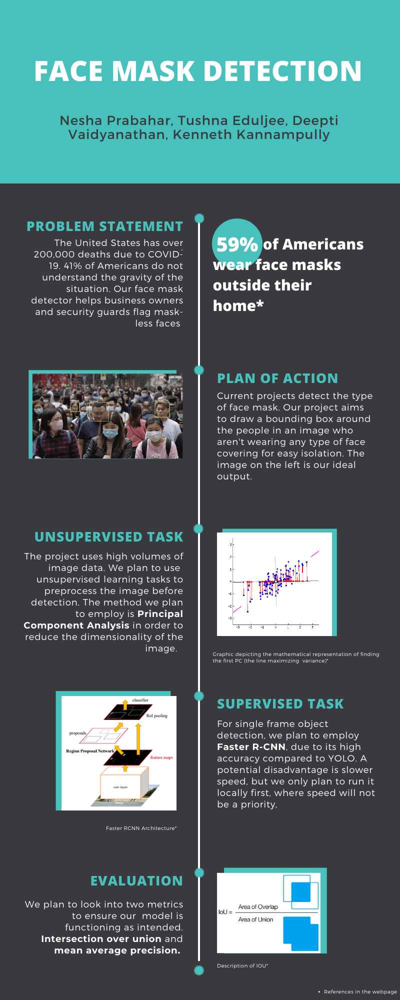

## CS 4641: Face Mask Detection

Contributors (alphabetically): Tushna Eduljee, Kenneth Kanampully, Nesha Prabahar, Deepti Vaidyanathan

### Introduction and Background

COVID-19 has truly changed the world and has forced everyone to rethink how we operate our day to day lives. From working from home to social distancing, life in 2020 is very different from life in 2019. One of these major changes is the introduction of masks as a public health measure to reduce the spread of this disease. However, a lot of citizens have pushed against mask mandates and will not comply with policies of business by not wearing their mask. This causes a public health risk and a hassle for business owners who have to ensure that all of the customers are wearing a mask. To combat this issue, it would be very helpful to have an automated way to detect the people who do not wear masks in these enclosed spaces.

In the past, there have been similar projects that have been aimed at classifying the different types of masks (i.e. cloth mask, surgical mask, or no mask). Instead of just classifying these images, we want to take this project to the next step and perform an object detection task, where we aim to draw a bounding box around all people in a given image who are not wearing a mask.

### Methods
We aim to use unsupervised learning for data processing and supervised learning for the remaining model. Since our project deals with high volumes of image data, and our model will require quite a bit of processing power in order to train, we plan on using some form of unsupervised learning in order to reduce the image dimensionality or feature space as it comes into our model. In order to do so, we aim to look into PCA (principal component analysis) in order to reduce the dimensionality of incoming images.

In addition, we will use supervised learning in order to identify the people in the frame who are not wearing a mask using existing object detection architectures. To train our model, we found a [kaggle dataset](https://www.kaggle.com/sigmind/masked-face-detection-wider-dataset?select=COVID-mask-detection_WIDER.tar.xz) that has labeled bounding boxes around mask wearers and non-mask wearers. After studying various object detection models (YOLO, SSD, Faster-RCNN, and R-FCN), we have decided to use the Faster-RCNN model because it is ideal for our task. Faster-RCNN is the best for our purposes since we are only focusing on single-frame image data rather than real time video processing, and therefore do not require the speed that these other multi-frame object detectors may provide. Compared to the other models, which make various trade-offs in accuracy and confidence for speed in order to work well in real time with multi-framed data, Faster-RCNN will work the best for us since it is more focused on accuracy than speed.

### Results
We will be evaluating our model based on the Intersection-Over-Union metric, which will inform us how well our detector's bounding boxes line up with the ground truth. Our IoU threshold will be 0.5. In addition, we would also like to use the average precision metric along with a PR-curve in order to evaluate the precision and recall of our detector.

### Discussion
If we are able to achieve our goals, we would have built a way to accurately detect multiple people who are not wearing a mask in a picture. This could then be implemented in security cameras in enclosed spaces, allowing business owners to do real time monitoring of the people in their stores.

Another potential use of this technology would be to use it to detect the most common areas indoors or outdoors where people do not have masks. One could then take this information and use it to avoid the high risk areas where people do not comply with mask mandates.

### References
1. “Face Mask Detection System Using AI: AI Mask Detection.” Software Development Company, www.leewayhertz.com/face-mask-detection-system/. 
2. “Faster R-CNN: ML.” GeeksforGeeks, 1 Mar. 2020, www.geeksforgeeks.org/faster-r-cnn-ml/. 
3. Gandhi, Rohith. “R-CNN, Fast R-CNN, Faster R-CNN, YOLO - Object Detection Algorithms.” Medium, Towards Data Science, 9 July 2018, towardsdatascience.com/r-cnn-fast-r-cnn-faster-r-cnn-yolo-object-detection-algorithms-36d53571365e. 
4. Jaadi, Zakaria. “A Step by Step Explanation of Principal Component Analysis.” Built In, builtin.com/data-science/step-step-explanation-principal-component-analysis. 
5. Katz, Josh, et al. “A Detailed Map of Who Is Wearing Masks in the U.S.” The New York Times, The New York Times, 17 July 2020, www.nytimes.com/interactive/2020/07/17/upshot/coronavirus-face-mask-map.html. 
6. Koech, Kiprono Elijah. “On Object Detection Metrics With Worked Example.” Medium, Towards Data Science, 10 Sept. 2020, towardsdatascience.com/on-object-detection-metrics-with-worked-example-216f173ed31e. 
7. Ren, Shaoqing, et al. “Faster R-CNN: Towards Real-Time Object Detection with Region Proposal Networks.” ArXiv.org, 6 Jan. 2016, arxiv.org/abs/1506.01497. 
8. Rosebrock, Adrian. “Intersection over Union (IoU) for Object Detection.” PyImageSearch, 18 Apr. 2020, www.pyimagesearch.com/2016/11/07/intersection-over-union-iou-for-object-detection/. 
9. Sigmind. “Masked Face Detection In the Wild Dataset.” Kaggle, 19 June 2020, www.kaggle.com/sigmind/masked-face-detection-wider-dataset?select=COVID-mask-detection_WIDER.tar.xz. 

